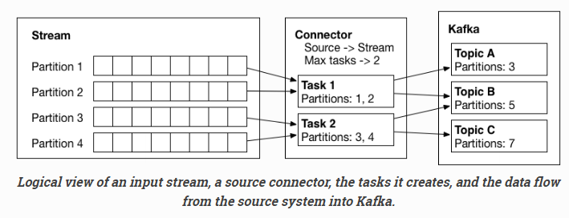

Kafka Connect 入门
=================
## 简介

>部分翻译自[原文](http://docs.confluent.io/3.0.0/connect/userguide.html)

Kafka Connect 是用于 Kafka 和 其他系统间做 ETL 的一个工具。

### 角色
Connect 包含 Worker、Connector、Task 三个角色，成层级关系。如下图所示:
<center></center>

### Offsets

### 运行模式
Connect 的运行模式有两种 `Standalone` 和 `Distributed`。
**Standalone**
Standalone 模式是单进程中运行所有的 Connector 和 Task，存在单点故障。但是适用于采集日志等与数据源耦合性非常高的场景，可以使用其他的监控方式解决进程的故障问题。
个人基于 Standalone 模式开发目前公司使用的[实时日志采集程序](https://github.com/hk-Lei/thor)，感谢老婆帮忙写了[监控页面](https://github.com/hk-Lei/thor-ui)(包含邮件告警功能)。

Standalone 模式的启动命令如下:
``` bash
$ bin/connect-standalone worker.properties connector1.properties [connector2.properties connector3.properties ...]
```

Standalone 模式的 Offset 存储是使用本地文件方式，在如上的进程配置文件 worker.properties 中的 `offset.storage.file.filename` 配置项中指定其存储的文件名

**Distributed**


## 使用说明


## 注意
